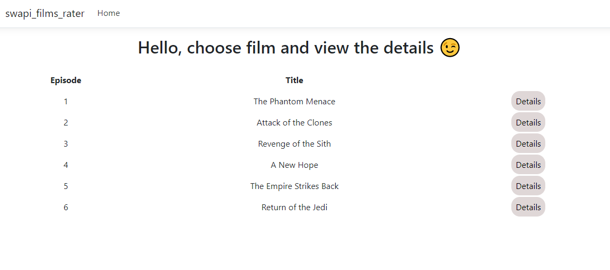
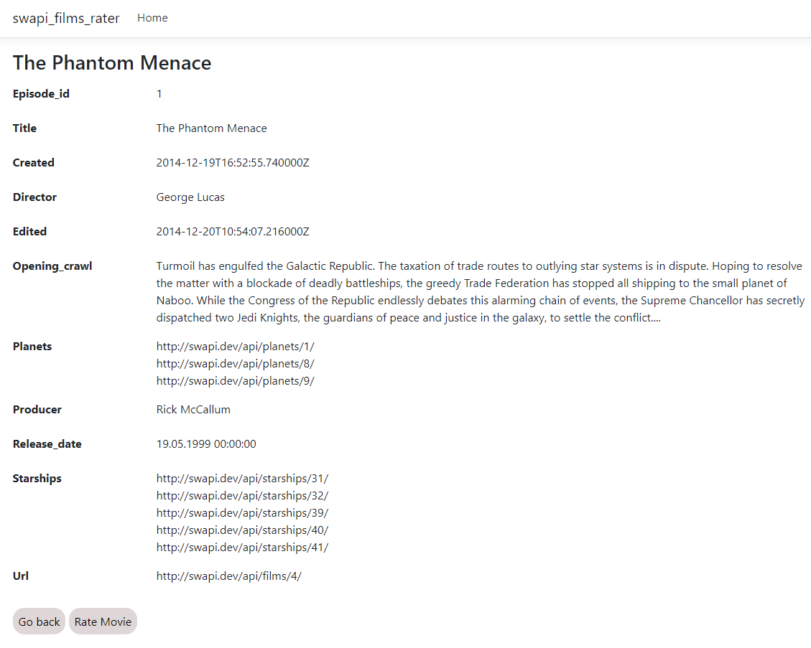
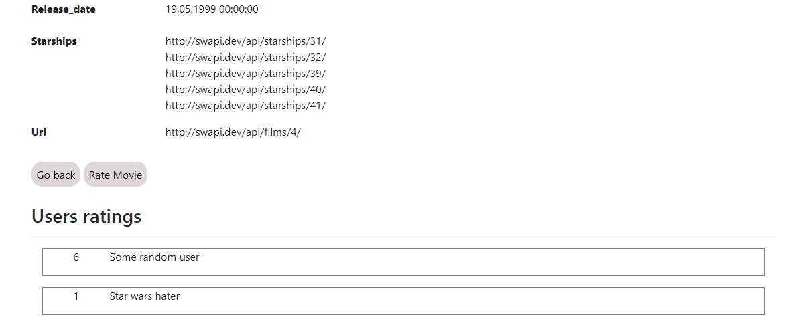
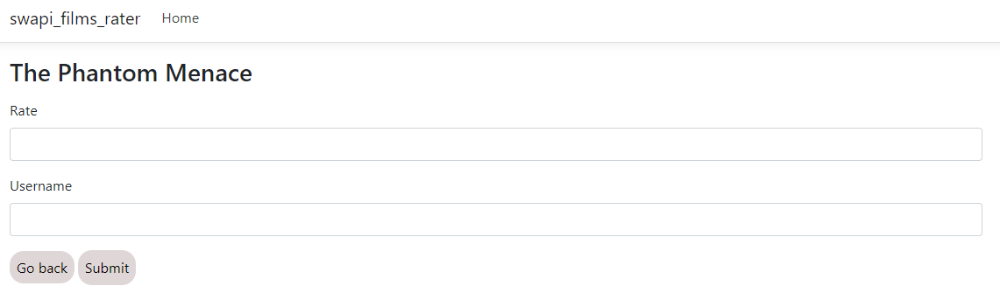

# Swapi films rater
Simple web service for getting the list of Star Wars films and rating them from 0 to 10. 😊

## Setup
1. Download repository
2. Change DB connection string in **swapi-films-rater/appsettings.json**, default setting is:
    ```json
    "ConnectionStrings": {
        "ConnString": "Server=.;Database=swapi-films-rater;Trusted_Connection=True;MultipleActiveResultSets=true"
    }
    ```
3. Run project using cmd command:
    ```terminal
    dotnet run
    ```
    or...  
4. Building an app:
    ```terminal
    dotnet build -o BuildDirectory
    ```
5. Running builded .exe file from build output directory.
6. Go into address listed in terminal. 😉

## Summary
Simple web service created with .NET Core, MVC and MSSQL.  
App fetches Star Wars movies from the api and listed it on main page. User can view a bunch of details about chosen film, and rate it from 0 to 10. Ratings are stored in local DB.  
All ratings in the service are listed on film details page.

## Overview
Web service is divided into separate projects:
1. DB - for handling DB operations like
    - creating and modifying DB using sqlcontext and migrations
    - modifying data in DB (using EF)
2. Models - for storing API, DB and View-Models
3. Repository - for handling communication between web service and DB / API
4. MVC - for present the data :)

## Screenshots

1. Main page

2. Film details example

3. Ratings on the details page

4. Rating page

